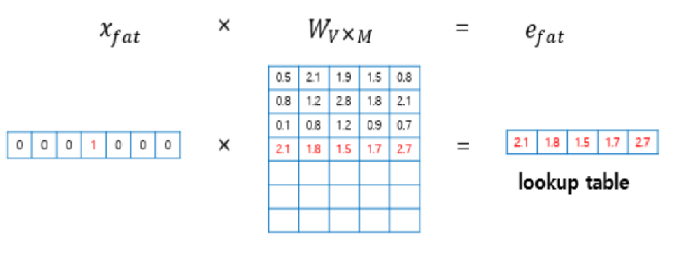

## onehot vector란?

Vector의 크기=> R^|v| 전체 단어의 종류 수 \*1
w^(zebra)=[1 0 0 0 0 0 0 0 0 ... 0]^T (^T는 전치행렬을 말한다.)
<b>W^(zebra)=> zebra라는 단어를 벡터로 나타낸 값을 표현한다.</b>
이 처럼 zebra에 해당하는 값만 1로 하고 나머지는 0으로 한다.

### 단점

1. sparse => 희박하다. vector의 크기에 비해 나타내는 정보가 너무 작다.
   이는 머신러닝 모델의 오작동을 유발할 수 있따.
2. 단어간 유사도 평가 불가
   one hot vector의 특성상 각 단어간의 코사인 유사도(=내적)=0이므로 단어 간 유사도를 나타내지 못한다는 단점이 있다.

## Word Embedding

그래서 이를 극복하기 위해 R^|v| 크기의 백터가 아니라.
R^n (n<|v|)인 벡터를 사용하려고 한다.
W^(zebra)=(0.2,-0.4, 0.7, ...) 이 처럼 0,1만이 아니라 실수값으로 기존보다 작은 크기의 벡터로 단어를 표현하는 것

### 특징

word embedding 한 결과
단어간 의미의 차이가 벡터로 보존이 된다.
즉, W^(남자), W^(여자) 벡터의 차이가 W^(왕), W^(여왕)과의 차이와 유사하다.

# NNLM

one-hot encoding의 단점을 극복하기 위해 제안됨
각 단어는 word embedding을 통해 word feature 벡터로 표현
그리고 단어간 순서는 결합확률분포를 통해 표현됨

1. 단어를 어떻게 word featrue vector로 바꿀 것인가?
2. 어떻게 결합확률 분포값을 높일 수 있을까?

## 기존 count 기반 모델

조건부 확률의 곱을 통해 문장의 결합 확률을 나타내고 다음 단어를 예측한다.
Ex) I like dog, it makes me happy.
`P(I)*P(like|I)*P(dog|like,I).....`
이런식으로 모든 순서의 확률을 알고 있어야 한다.
그래서 마르코브 추정을 통해 (무기억성) 몇 개만 알아도 된다.고 가정
그래서 n-gram을 통해 주변의 몇 개만 보고 추정한다.
그러나 만약 해당 시퀀스(순서)가 주어진 데이터에 없다면?
예측확률=0

## NNLM 방식

그래서 이를 해결하기 위해서, 정확히 해당 시퀀스가 없더라도 유사한 시퀀스의 단어가 존재함을 모델이 알 수 있으면 해결된다.
Ex) I like Dog라는 문장이 데이터에 없더라도  
I like puppy라는 문장이 있고 
Dog와 puppy가 유사하다는 점을 안다면  
I like Dog라는 문장의 확률을 
I like puppy를 통해 유사하게 계산가능 하다. 

### 진행과정

- t번째 단어를 예측하는 경우

1. word OneHot Vector=> Word Feature Vector
   기존의 Onehot Vector를 더 적은 크기의 실수 벡터로 변환
   방식은 행렬 곱을 통해서
   이 전반적 과정을 lookup table라고 부른다. 결과를 lookup table이라고 하는거 아님!!
   
   [출처] https://wikidocs.net/45609

2. hidden layer에다가 각 단어의 feature vector를 입력한다.
   그 뒤 전체 단어 벡터 |V|에서 단어마다 t번째 단어의 확률을 계산한다.
   그 중 실제 t번째 단어가 t번째일 확률이 제일 크도록 가중치를 조절한다.

# Word2Vec

NNLM vs Word2Vec
NNLM => n개 후 다음 단어 예측하는 신경망 생성
Word2Vec => 주변 단어를 통해 해당 단어 예측(CBOW), 한 단어를 통해 주변 단어 (Skip-gram)

# pLSA

vs LSA
non-negetive 조건
합이 1인 조건
확률로 표현가능하다.!

# LDA

특정한 문서 생성과정을 전제로 두고 만들어진 문서를 그에 따라 역추적하여 토픽을 추론하는 방식이다.

### 전제

1. 각 문서는 토픽의 분포로 이루어져 있다.
2. 각 토픽은 단어들의 분포로 이루어져 있다.

### 생성 과정

1. 토픽의 갯수를 정한다.
2. 문서별 토픽의 분포를 정한다.
3. 각 토픽별 단어의 분포를 정한다.
4. 각 문서 별 단어에 어떤 토픽을 할당할지 정한다.
5. 해당 토픽에서 어떤 단어를 추출할지 정한다.

### 특징

- 토픽별 단어의 분포는 어떤 문서에서든 동일하다.
  => 문서에 따라 토픽별 단어 분포는 달라지지 않는다.

  사람이 문서를 작성하는 방식과는 달리 각 단어들은 토픽에 종속이 되지 선후 단어와는 관련이 없다.
  즉, 앞 뒤 단어와는 생성과정이 연관이 없다.
